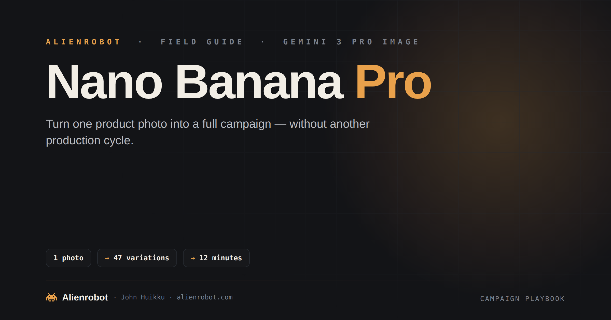
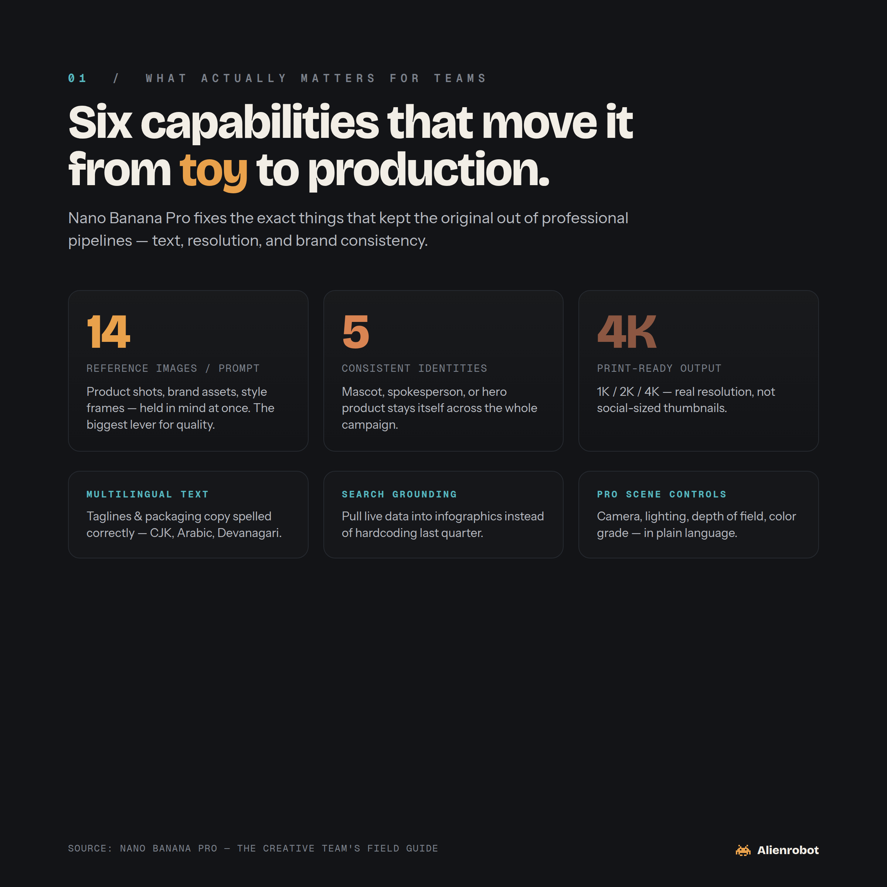
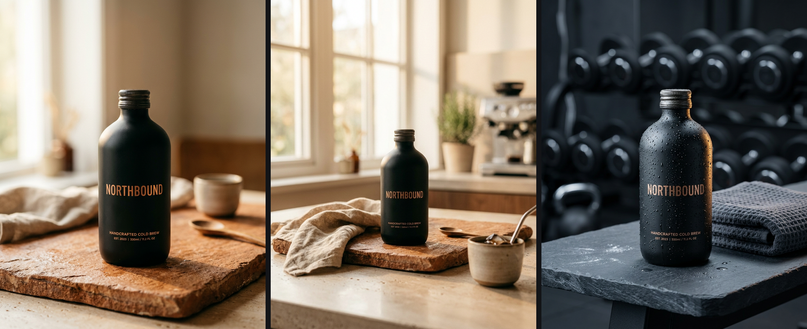
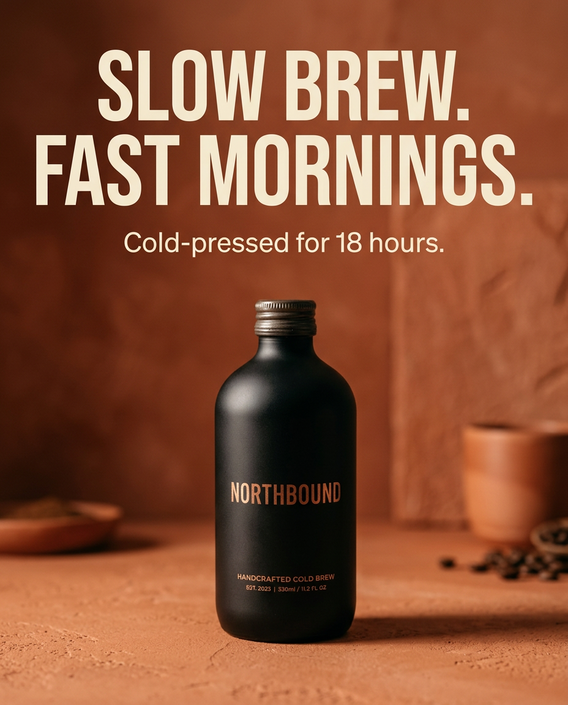
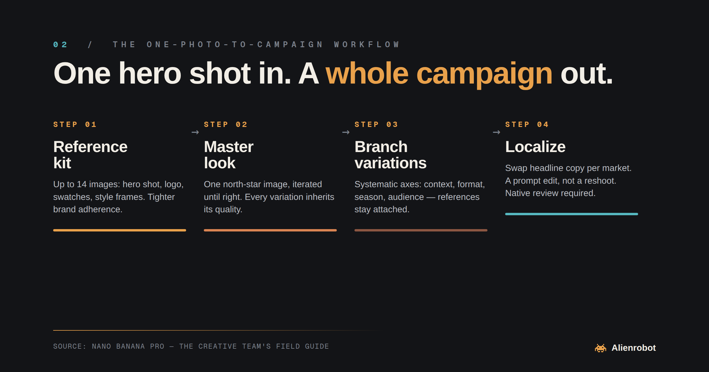

# Nano Banana Pro: The Creative Team's Field Guide

### Turn one product photo into a full campaign — without another production cycle.

---

## What this actually is

**Nano Banana Pro** is Google's professional image generation and editing model, built on **Gemini 3 Pro Image**. The original Nano Banana (Gemini 2.5 Flash Image) went viral for creative edits but stumbled on the fundamentals — legible text, high resolution, brand consistency. The Pro release fixes exactly the things that kept it out of professional pipelines.

The short version: **it's the first image model that behaves less like a toy and more like a junior production artist who never sleeps.**

| Capability | Why it matters for teams |
|---|---|
| **14 reference images per prompt** | Feed it product shots, brand assets, style frames, and packaging — held in mind at once. The single biggest lever for quality. |
| **5 consistent identities** | Your mascot, spokesperson, or hero product stays recognizably itself across an entire campaign. |
| **1K / 2K / 4K output** | Print-ready resolution, not just social-sized thumbnails. |
| **Accurate multilingual text** | Taglines and packaging copy that's actually spelled correctly — including CJK, Arabic, and Devanagari. |
| **Search grounding** | Pull live data into infographics instead of hardcoding last quarter's numbers. |
| **Pro-level scene controls** | Camera angle, lighting, depth of field, focus, and color grade — via natural language. |

---

## Seeing it work

*Everything below was generated with Nano Banana Pro — one fictional brand, "NORTHBOUND," to keep the examples honest.*

**The one-photo-to-campaign move.** Generate one master hero shot, then feed *that image back* as a reference to drop the product into new contexts. Same bottle, same copper label, same "HANDCRAFTED COLD BREW" copy — three scenes, one product:

Left: the master hero shot (text-to-image). Middle & right: kitchen and gym variations, generated by attaching the hero as a reference — the product stays itself while the world around it changes.

**Text that's actually spelled right.** The feature that moved it into professional pipelines — legible headline typography, rendered in-image:

The same NORTHBOUND bottle from above, turned into a finished poster with the hero attached as a reference — headline, tagline, and on-pack copy all rendered correctly in a single generation, no post-production text layer.

---

## Part 1 · The one-photo-to-campaign workflow

This is the workflow behind *"one product photo → 47 variations in 12 minutes."* Here's how to run it for real.

### ① Build your reference kit
Before you generate anything, assemble your inputs:

1. **Hero product shot** — your cleanest, best-lit photo of the actual product
2. **Brand assets** — logo files, brand color swatches (literally a swatch image works), one or two existing on-brand ads
3. **Style targets** — a mood frame or two showing the lighting/composition style you want

You can attach up to **14** of these in a single prompt. More references = tighter brand adherence. This is the single biggest lever for quality.

### ② Lock the master look
Generate one "north star" image first and iterate until it's right:

> *"Using the attached product photo and brand assets: place the product on a warm terracotta surface, soft directional morning light from camera-left, shallow depth of field, negative space upper-right for headline text. Match the color grade of the attached style frame. 4K, 4:5 aspect ratio."*

Don't rush this step. **Every downstream variation inherits the quality of your master.**

### ③ Branch into variations
Once the master is approved, generate systematically along axes:

- **Context** — kitchen counter / gym bag / office desk / beach towel / holiday table
- **Format** — 1:1 feed, 4:5 portrait, 9:16 story, 16:9 banner, 2:3 print
- **Season / campaign** — summer palette, holiday styling, back-to-school
- **Audience** — minimal-premium vs. bold-value vs. playful-Gen-Z treatments

Keep the reference images attached in *every* prompt. That's what keeps variation #47 looking like the same brand as variation #1.

### ④ Localize
Because text rendering is now genuinely reliable, localization becomes a prompt edit, not a reshoot:

> *"Same image, replace the headline with: \[Japanese tagline]. Keep typography weight and placement identical."*

Run it per market. Have a native speaker verify copy — the model renders text accurately, but it renders *what you give it*, so garbage-in still applies.

---

## Part 2 · Playbooks by role

<table>
<tr>
<td width="50%" valign="top">

### 📸 Photographers
Your shoot is no longer the deliverable — it's the *seed*. Shoot fewer, better hero frames with clean lighting and full product coverage (front, three-quarter, detail). Then deliver hundreds of contextual variations generated from those masters. **Price accordingly:** you're selling a variation-ready asset library now, not a folder of JPEGs.

</td>
<td width="50%" valign="top">

### 🎨 Designers
Use it as a real-time concepting engine in client calls. *"What if the background were darker? What if we tried it horizontal? What about a lifestyle context?"* — answered in 15 seconds instead of *"we'll get back to you Thursday."* Art-direct with the camera / lighting / color-grade vocabulary you already have.

</td>
</tr>
<tr>
<td width="50%" valign="top">

### 📊 Marketing teams
A/B testing stops being gated by creative production. Generate 10 headline treatments, 5 background contexts, 3 color stories — and let the data decide. Pair with search grounding to build infographics that reflect *current* numbers, not whatever was true when the deck was made.

</td>
<td width="50%" valign="top">

### 🛒 Ecommerce brands
Every SKU, every market, every season. Localized lifestyle imagery per region (correct language on packaging and overlays), seasonal refreshes without reshoots, and marketplace-specific crops at 4K so nothing gets rejected for resolution.

</td>
</tr>
</table>

---

## Part 3 · Prompting patterns that work

- **Be a director, not a wisher.** Instead of *"make it look nice,"* specify: *"85mm look, f/2 depth of field, soft key from camera-left, warm 3200K practicals in background, slight teal shadow grade."* The model understands cinematography language — use it.
- **Iterate with edits, not regenerations.** Once an image is close, ask for surgical changes: *"Keep everything identical, only change the label text to X."* This preserves what's working.
- **One axis of change per prompt.** When building variation sets, change context **or** format **or** copy — not all three at once. Coherent sets, diagnosable failures.
- **Name your consistency targets.** *"Maintain the exact same model's face and the exact product from the reference images."*
- **Use thinking mode for complex compositions.** Multi-subject scenes, dense infographics, and layout-heavy work benefit; simple variations don't need it.

---

## Part 4 · Honest limitations

> **Read this before you promise a client anything.**

- **It's a variation engine, not a truth engine.** Product details can drift subtly — label kerning, port placement, stitch patterns. For regulated categories or anything with legal claims on-pack, human-QC every image before it ships.
- **Native-speaker review is still mandatory** for localized copy. Accurate rendering ≠ accurate translation.
- **Rights and disclosure.** Know your org's policy on AI-generated imagery, model-likeness usage, and platform disclosure requirements before publishing. Some ad platforms and retail partners have their own rules.
- **It amplifies your taste; it doesn't supply it.** Teams with a strong art director get 10× output. Teams without one get 10× mediocrity, faster.

---

## Part 5 · Getting started this week

| Day | Do this |
|---|---|
| **1** | Pick one product. Assemble a 10–14 image reference kit. Generate a master. |
| **2** | Build a 20-variation set across contexts and formats. Note which prompts produced keepers — those become your team's prompt library. |
| **3** | Localize your top 3 variations into your two biggest non-English markets. Get them reviewed. |
| **4** | Run a small paid A/B test with the variation set against your current creative. |
| **5** | Review the data, document the workflow, and train the team on the prompt library. |

The teams that win with this won't be the ones who generate the most images. They'll be the ones who build the tightest **system** — reference kits, prompt libraries, QC checklists — around it.

**Don't be most teams.**

---

&nbsp;
&nbsp;
&nbsp;

  

**👾 Alienrobot** · John Huikku · [alienrobot.com](https://alienrobot.com)

Field guide, not affiliated with Google. "Nano Banana Pro" and "Gemini" are Google's marks.

